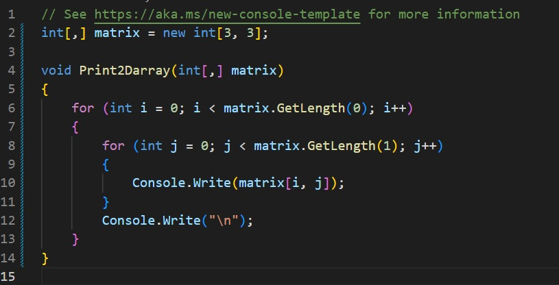
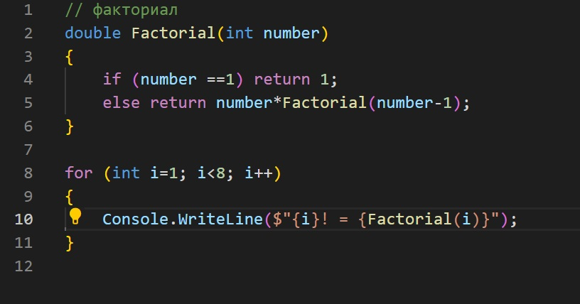
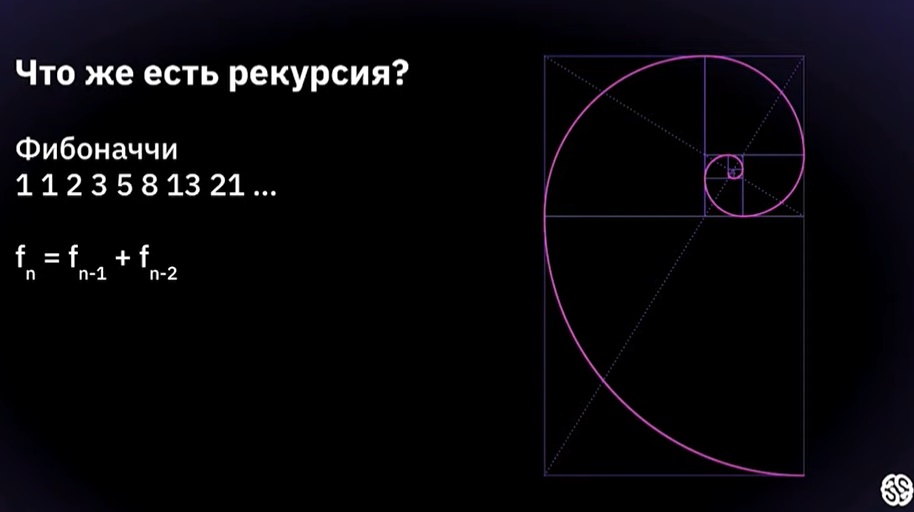
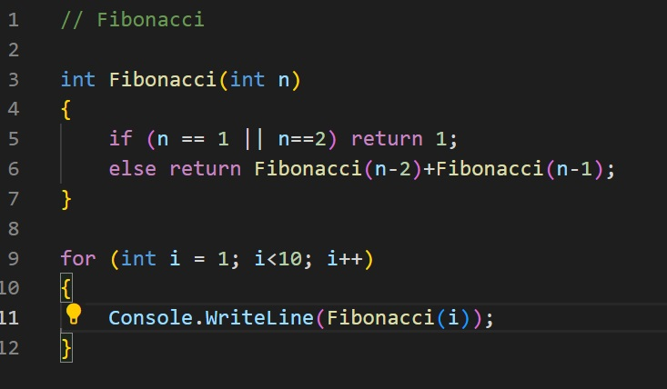
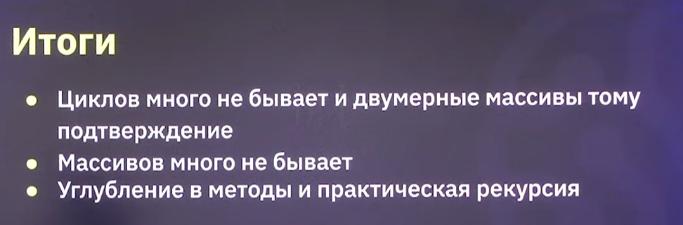

# Лекция 4
<u>Рекурсия и многомерные массивы</u>

### Двумерные массивы

Двумерные массивы это частный случай многомерных массивов. В С# он задаёстся следующим образом:

> ВАЖНЫЙ МОМЕНТ. Нумерация индексов идёт с нуля!

Как печатать двухмерный массив?

Работа с двухмерными массивами происходит с помощью вложенного цикла. Внешний цикл перещёлкивает 1е измерение(строки), внутренний - 2е(колонки).

### Рекурсия

> <i>"Чтобы понять рекурсию, надо понять рекурсию"</i>

>Метод вызывающий сам себя, называется рекурсией.

Наглядным примером рекурсии является ычисление факториала. Факториалом числа n называют число равное произведению всех чисел от 1 до n.

То есть 5! можно представить вот так:

> 5! = 5*4!
>>4! = 4*3!
>>>3! = 3*2!

И так далее.

Код такой фунции будет выглядеть так:

Другой хороший пример *рекурсии* - это числа Фибоначи. 

Числами Фибоначи называют последовательност чисел, в которой каждое следующее число равняется суммой 2х предыдущих.

Код такой функции будет выглядеть так:

В заключение:

