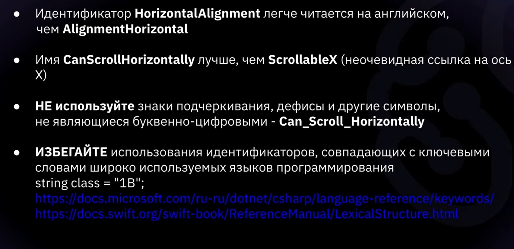
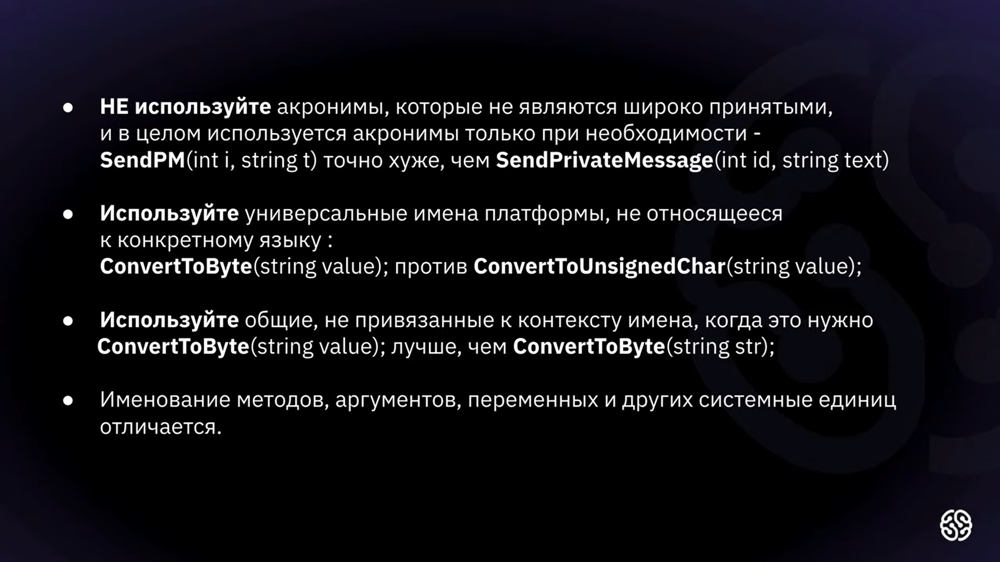
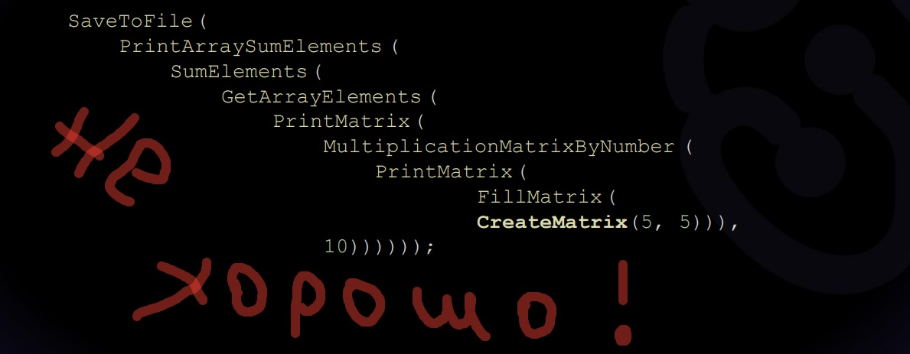

# Как не нужно писать код. Часть1.

Первое и саое главное:

> <u>Нейминг</u> это краеугольный в программировании. Правильный нейминг в разы упрощает читаемость написанного кода.
 

 

*Код больше читается больше, чем пишется. Поэтому не нужно экономить на понятности названий*

#### Далее будут перечислятся универсальные правила написания кода, актуальные для большинства языков программирования.

1. Стараться избегать сокращений.
2. Стараться использовать имена с простыми названиями.
3. Избегать в нейминге запретные слова. Имеются в виду, не только обсценная, неполиткорректная или сексистская лексики, но и ключевые слова в самом языке программирования.
4. Стараться избегать использования нижних подчёркиваний.

И ещё немного рекомендаций:

И ещё немного:

Также следует:

1. Избегать длинных строк в коде и стараться переносить.

2. ВСЕГДА! всегда пользоваться автоформатированием кода в VS Code.

#### Правила форматирования кода актуальные в С#

1. Использовать нотацию Pascal для нейминга ***методов*** (например *SetRandomAsset()*), и нотацию Camel для нейминга переменных и аргументов (например ***int lastNumerInArray***).
2. Объявлять переменные перед непосредственным их использованием. Строго избегать ситуаций, в которых  объявляется переменная в начале кода и через 200+ строчек кода она наконец используется.
3. Называть индексы простым способом. Не нужно придумывать сложносоставных названий для локальной переменной, значимость которой находится "где-то в конце". 
4. Стараться избегать неявной типизации <code>var</code> там, где без неё можно обойтись.
5. Стараться избегать "каскадных" вызовов методов. Хороши тоном считается не более 3. (см. скрин)

#### Немного о комментировании

* В большинстве языков программирования комментарии определяют символы <code>//...</code> или <code>/* ...*/</code>, где троеточие это комментируемый текст или код.
* Неиспользуемый код лучше удалить, чем закомментировать
* Тэг в комментариях "TODO:" указывает что код не завершён, а текст после такого кода это указания, что нужно сделать, чтобы всё заработало.

