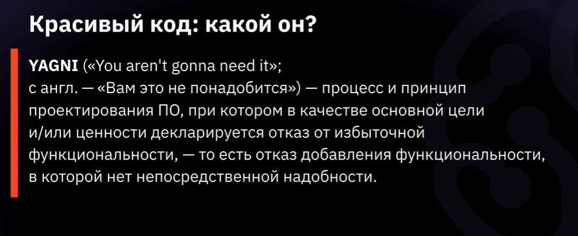

# Как не нужно писать код. Часть2.

<u>Что такое  красивый код?</u>

 

> <u>Гибкость.</u> Под этим подразумевается, что нужно стараться писать код таким образом, чтобы написанные нами методы или модули можно было переиспользовать в других программах. !Однако! Не стоит переусердствовать с этим пинципом.

> <u>Расширяемость.</u> Под этим подразумевается, что стоит писать свой код таким образом, чтобы можно было добавлять новый функционал без ишних силий и максимально безболезненно.
 
> <u>Модульность.</u> Под этим подразумевается, что код стоит писать модулями, такими чтобы было проще отлаживать программу и дополнять её.

> <u>Поддерживаемость.</u> Под этим подразумевается, что следует придерживаться понятного и информативного нейминга, чтобы любой другой мог поддерживать нашу программу.

> <u>Документированность.</u> Под этим подразумевается, что следует <i>документировать свои методы</i>, для этого есть инструменты в каждом языке программирования свой.

Далее будет несколько универсальных принципов

 

# В заключение

