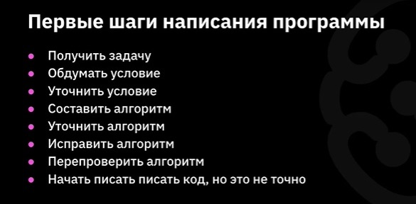
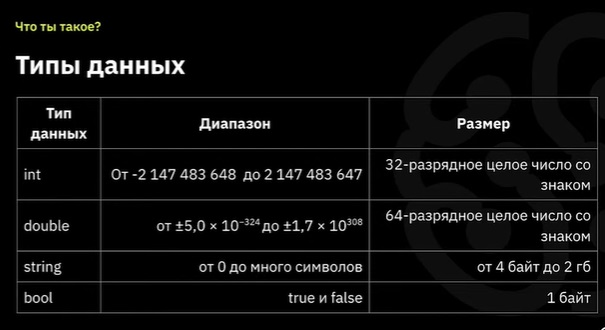

#  Знакомство с С# 

> ##  Почему C# ?
> ПОТОМУ ЧТО ЭТО ОДИН ИЗ ТОП 10 ЯЗЫКОВ, И ОН ОЧЕНЬ ПОПУЛЯРЕН.

 С# очень похож на Java и С++.  Кто-то мог бы сказать, что это *lovechild* этих двух языков. 

ГЛАВНЫЙ ПОСЫЛ КУРСА:

ЯЗЫК ПРОГРАММИРОВАНИЯ - ЭТО ВСЕГО ЛИШЬ ИНСТРУМЕНТ

##  Что такое программа? 

Если представить программу схематично, то получится такая "матрёшка":

> ИНТЕРФЕЙС
>> ЛОГИКА
>>> ДАННЫЕ

Или вот такая схема:

<i> Входные данные -> Программа (алгоритмы) -> Выходные данные </i>

>  ВСЕГДА! ВСЕГДА лучше разложить программу на алгоритм, прежде чем писать код. 

Как писать программы: 

 

##  Синтаксис и команды 

В коде С# можо оставлять комметарии для этого достаточно ввести "<code>//</code>", и всё, что написано после этих символов, будет являться комментарием (то есть не будет учитываться при проверке синтаксиса и компиляции).

Также в языке С# есть разделители. Они нужны для того, чтобы машина понимала, где заканчивается одна команда и начинается другая. Разделителем служит символ "<code>;</code>".

В языке С# для того, чтобы поместить данные в ячейку памяти (переменную), есть оператор *присваивания* и обозначется символом "<code>=</code>".

 *Консольные команды* 

> <code>dotnet new console</code> - Создаёт новую консоль для запуска программы.
>
> <code>dotnet run</code> - Компилирует и запускает написанную команду.
>
> <code>Console Clear</code> - Очищает консоль.
> 
> <code>Console SetCursorPosition (1;2)</code> - Переносит курсор вправо (делает отступ слева) на 1 символ и на 2 строки вниз (делает отступ сверху).  

 *Команды С#* 

Для хранения различный данных системе требуется различные объёмы памяти. Для того, чтобы оптимизировать выделение памяти, в языках программирования предусмотрены различные типы переменных. В С# предусмотрены следющие типы данных:

  

 

Это далеко не все типы данных, но это ***самые основные***.

*Итак, сами команды:*

> <code>Console.Write("text")</code> - Выводит данные на экран консоли без перевода строки. Аргументом данной команды может быть переменная или произвольный текст, заключённый в кавычки. 
>
> <code>Console.Writeline("text")</code> - Выводит данные на экран консоли с переводом курсора на новую строку. Аргументом данной команды может быть переменная или произвольный текст, заключённый в кавычки.
>
> <code>Console.Readline(variable)</code> - Считывает введённые пользователем данные в переменную.

Итак, простейшая классическая программа Hello, world на языке C# будет выглядеть следующим образом:

 

<code>Console.Writeline("Hello, World!"); </code>

Следующим шагом будет приветствие пользователя. Хорошим тоном будет подсказать пользователю, что от него требуется. Для этого Следует вывести текст, подсказывающий, что требутся от пользователя. Например, можно спросить как его зовут.

Представим в виде алгоритма такую программу:
* Вывести на экран "Как вас зовут?";
* Считать имя пользователя (задаём переменную username, так как это имя тип переменной зададим *string*);
* Вывести "Привет, "  и имя пользователя.

Итак, сам код будет выглядеть так:

 

<code>
Console.Writeline("Как вас зовут?");

string username = Console.Readline();
Console.Write("Привет, ");
Console.Writeline(username);
 </code>

На этих классических примерах можно получить начальное представление, как выглядит синтаксис языка С#.

> Параметр <code>.ToLower</code> переводит введённую строку в нижний регистр. То есть, если пользователь вводит что-то вроде "кАрАмБА", введённый текст превращается в "карамба". 

 *Операторы условия и цикла* 

В программировании одними из наиважнейших инструментов являются циклы и условия. Рассмотрим синтаксис данных инструментов.

Условие:
> <code> if (условие)
>
>{
>
>   действия при выполнении условия
>
>}
>
>else
>
>{
>
>   действия при невыполнении условия 
>
>}
> </code>

*Ветка с невыполнением условия, начиная с* <code>else</code>*, необязательна и не всегда нужна.*

Цикл:
> <code> while (условие)
>
>{
>
>   действия при выполнении условия
>
>}

