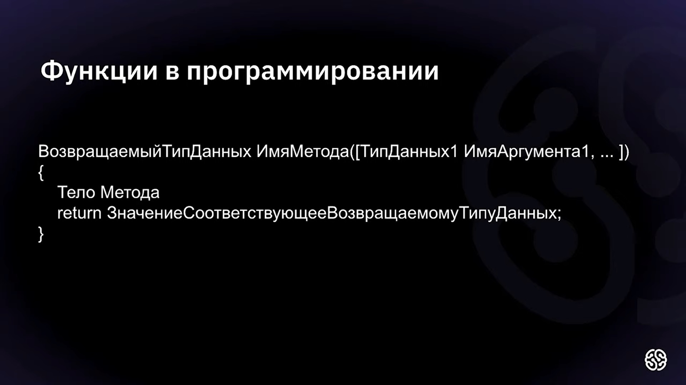

> # 
 ПРОЦЕДУРНЫЙ ПОДХОД К ПРОГРАММИРОВАНИЮ 
 

 
ЖИЗНЕННО ВАЖНЫМИ ИНСТРУМЕНТАМИ для такого подхода являются:

*  МАССИВЫ
*  ФУНКЦИИ 

> Строго, говоря в С# нет понятия функций, здесь они называются *МЕТОДАМИ*.

##  ФУНКЦИИ 
Функции (методы) - это заранее описанный алгоритм, который имеет имя, через которое можно к этому алгоритму обратиться.

 Функции имеют несколько отличительных черт:

* имеет идентификатор;
* может имет входные аргументы;
* может возвращать значение.

 

Функции имеют следющую структуру:

*Пример* 

<code>
    int sqr(int a)
    
   {
    
int res = a*a;

return res;
    
}

</code>

> Плюсы от использования функций:
> 
> 1. Более компактный код по сравнению со стихийным методом
> 
> 2. Проще отыскивать отлавливать ошибки
>

##  МАССИВЫ 

Массивами называют структуры однотипных данных, имеющих индекс, по котору можно обратиться к элементу.

 Как определить массив в C# : 

> Есть такой параметр <code>.Length</code>, он возвращает длину массива.

##  Полезные команды 

<code>break</code> - Прерывает цикл.

<code>new int[size]</code> - Создаёт массив размера size, заполненный нулями.

<code>void</code> - тип метода, который не возвращаетзначений.

